<picture>
  <source media="(prefers-color-scheme: dark)" srcset="./dark.svg">
  <source media="(prefers-color-scheme: light)" srcset="./light.svg">
  
</picture>

### I build the integrations behind better business workflows.

**Business Central Technical Consultant** · **AL Developer** · **AI-Assisted Engineering**

[**Projects**](#selected-projects) &nbsp; / &nbsp; [**Toolkit**](#toolkit) &nbsp; / &nbsp; [**LinkedIn**](https://www.linkedin.com/in/dhirajsingh730/) &nbsp; / &nbsp; [**Public code**](https://github.com/Singhdhiru?tab=repositories)

---

### Hello, I'm Dhiraj 👋

**Business Central Technical Consultant building connected ERP solutions.**

I translate business requirements into **AL extensions, reliable integrations, and automated workflows**. My experience covers Business Central SaaS customization, CRM and payment integration, procurement, payroll, reporting, and data migration.

From requirements analysis to deployment support, I focus on code that teams can maintain and workflows that users can understand. I use **Codex, Copilot, and MCP tools** to support implementation, investigation, and documentation.

| 🧩 Extend | 🔗 Connect | ⚙️ Automate |
| :--- | :--- | :--- |
| AL business logic and ERP customization | CRM, payments, procurement, and APIs | Job Queues, reporting, and document delivery |

## Selected projects

Four resume-based projects. Client and internal project names are anonymized.

### 01 · 💳 Payment & Donation Compliance Integration
> **From payment records to traceable donation claims.**

**Business Central SaaS · AL · API Integration · XML · Reporting**

- **Claim processing:** developed donation eligibility validation, tax calculations, claim generation, exception handling, and reversals.
- **Connected workflows:** mapped CRM donor, pledge, and payment information into Business Central donation processing.
- **Payment reconciliation:** integrated payment records with validation and downstream claim workflows.
- **Lifecycle visibility:** implemented claim tracking and submission-ready XML/API structures.
- **Audit reporting:** created reports for claim review, payment reconciliation, exceptions, reversals, and audit summaries.

---

### 02 · 🔗 CRM & Business Central Integration
> **Customer and sales workflows connected across CRM and ERP.**

**Business Central SaaS · AL · REST APIs · Job Queue · Localization**

- **Operational synchronization:** developed customer, sales order, inventory, invoice, shipment, and short-close integration workflows.
- **API processing:** built staging tables, API pages, AL codeunits, and scheduled Job Queue automation.
- **ERP customization:** extended sales, purchasing, inventory, and finance using tables, pages, role centers, permission sets, and event subscribers.
- **Business reporting:** developed tax invoices, registers, packing lists, supplier invoices, and inventory reports.

---

### 03 · 🏗️ Procurement & Business Central Integration
> **Procurement information connected with purchasing and project costing.**

**Business Central SaaS · AL · HttpClient · JSON · APIs · RDLC**

- **Integration development:** implemented authenticated API communication, JSON processing, synchronization logs, and automated data exchange.
- **Procurement flows:** mapped purchase orders, invoices, receipts, suppliers, items, and budget information into Business Central.
- **Project workflows:** connected jobs, job tasks, and planning information with purchasing, inventory, warehouse, and project costing processes.
- **AL extensibility:** developed tables, pages, codeunits, queries, XMLports, permissions, and report extensions.
- **Operational improvements:** customized assembly processes and reporting to support reconciliation and business operations.

---

### 04 · 📄 Payroll & Payslip Automation
> **Recurring payroll documents generated, delivered, and tracked inside the ERP.**

**Business Central · AL · RDLC · Job Queue · Email Integration**

- **Payslip generation:** developed monthly and yearly RDLC reports with PDF output.
- **Salary management:** built tables and pages for salary components, deductions, gross/net pay, tax deductions, and employee-wise payslip status.
- **Email delivery:** automated individual and bulk payslip distribution with PDF attachments.
- **Scheduled processing:** configured Job Queue automation for recurring monthly delivery.
- **Delivery visibility:** tracked sent/error results to help HR users monitor processing.

## Engineering toolkit

| Area | Skills & tools |
| :--- | :--- |
| **Business Central** | SaaS customization · AL extensions · Tables · Pages · Codeunits · Events · Permission sets |
| **Integration** | REST APIs · Web services · HttpClient · JSON · XML · CRM integration · Data migration |
| **Automation** | Job Queue · Workflows · Email integration · Automated testing |
| **Reporting** | RDLC · Word layouts · Excel reports · Financial and operational reporting |
| **Delivery & AI tools** | Git · GitHub · VS Code · Postman · Docker · CI/CD · Codex · Copilot · MCP |

## How I work

**Requirements → Design → Implementation → Review → Validation → Handover**

- Understand the business process before choosing the technical approach.
- Make integrations traceable with validation, status tracking, and useful reports.
- Keep AL customizations maintainable and document the decisions that matter.
- Use AI assistance alongside review and validation tied to the requirements.

---

### Let's build better business workflows.

**Business Central · ERP integrations · Reporting · Automation**

