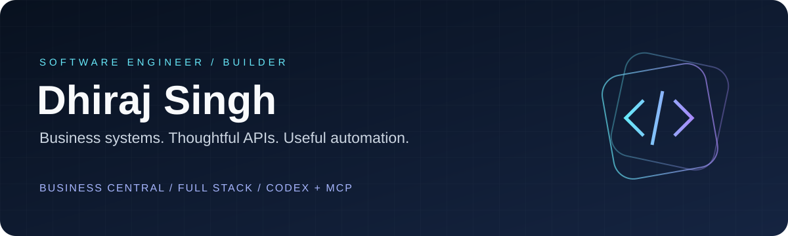

**BUSINESS CENTRAL & AL** &nbsp; / &nbsp; **BACKEND & FULL STACK** &nbsp; / &nbsp; **CODEX & MCP**

 

**Microsoft Dynamics 365 Business Central Technical Consultant** 
I build AL extensions, integrations, reports, and workflow automation. 
My work also includes web applications and developer tools built with AI assistance.

---

## About my work

My experience includes Business Central SaaS customization, API and CRM integration, payment workflows, procurement integration, reporting, and data migration. I work across requirements analysis, development, troubleshooting, deployment support, and documentation.

## 01 / Engineering across the stack

<table>
<tr>
<td width="33%" valign="top">

### 🧩 Business systems
Business Central extensions, AL objects, reports, workflows, and business integrations.

</td>
<td width="33%" valign="top">

### ⚙️ Application engineering
Web applications, backend APIs, data models, dashboards, and automation.

</td>
<td width="33%" valign="top">

### ✨ AI developer tooling
Codex collaboration, reusable assistant skills, MCP services, and development utilities.

</td>
</tr>
</table>

## 02 / Project portfolio

**28 projects · Enterprise integrations, applications, and developer tools.**

A combined list of my local project work and resume-backed experience. Private project titles use aliases. Entries include implementations, prototypes, research, and learning work; they do not imply that every project is complete or deployed.

### Enterprise & integrations

| Project | Work done / area of work |
| :--- | :--- |
| **Atlas · Business Workflow Extension** | Business application development, reporting, and documentation. |
| **Relay · Payment Integration** | Payment workflow integration development and review. |
| **Bridge · CRM & ERP Synchronization** | Business system integration and extension development. |
| **Ledger · Payroll Automation** | Payroll reporting and workflow automation. |
| **Signal · Submission Integration Lab** | Submission workflow research and integration exploration. |
| **Pulse · Internal Operations Extension** | Internal business application development. |
| **Procure · Procurement Integration** | Procurement integration, ERP extensions, and business reporting. |

### AI, automation & developer tools

| Project | Work done / area of work |
| :--- | :--- |
| **Orbit · ERP Assistant Bridge** | AI assistant integration with business applications. |
| **Scout · Career Research Agent** | Career research and reporting automation. |
| **Sequence · Numbering API** | Business application API development. |
| **QueueKit · Scheduling Utility** | Scheduled workflow configuration utilities. |
| **SkillForge · Assistant Skill Library** | Reusable guidance and tools for AI-assisted development. |
| **Canvas · AI Application Sandbox** | AI application experiments and development setup. |

### Web products & experiences

| Project | Work done / area of work |
| :--- | :--- |
| **Haven · Service Marketplace** | Service marketplace application development. |
| **Console · Operations Dashboard** | Administrative dashboard development. |
| **Studio · Consulting Website** | Consulting website development and presentation materials. |
| **Identity · Personal Portfolio** | Personal portfolio web development. |
| **Summit · Learning Experience Review** | Learning platform review, documentation, and demo preparation. |
| **Motion · Fitness Web Workspace** | Fitness application exploration. |
| **PriceLens · Retail Verification Prototype** | Retail application planning and prototype scaffolding. |
| **Journal · Content Backend** | Content application backend development. |

### Learning & engineering foundations

| Project | Work done / area of work |
| :--- | :--- |
| **Foundry · AL Practice Extension** | AL development exercises and test project setup. |
| **Academy · Modular ERP Learning Lab** | Structured business application learning modules. |
| **Launchpad · Full-Stack Starter** | Reusable full-stack development setup. |
| **AccessKit · Permission Utility** | Business application permission utilities. |
| **CheckPoint · Test Sandbox** | AL experiments and test exercises. |
| **Pathfinder · Technical Preparation** | Technical learning and interview preparation. |
| **Algorithms · C++ Practice** | Data structures and algorithm practice. |

<strong>Reference workspaces & supporting materials</strong>

 

My local setup also includes upstream application source, an AL dependency-inspection MCP tool, scheduling and CMS reference checkouts, backend experiments, ERP customization workspaces, and user-guide materials.

Reference checkouts are learning resources; I do not claim authorship of their upstream implementations. Duplicate copies, generated worktrees, and supporting document folders are grouped with their related projects.

## 03 / How I build with Codex

**Understand → Design → Implement → Review → Validate → Document**

I use Codex to inspect existing code, clarify requirements, draft implementations, investigate bugs, and prepare documentation. Reusable skills and MCP tools help connect assistant workflows to real development tasks.

My priorities are clear context, deliberate changes, and validation that matches the work.

## 04 / Tools I work with

| Area | Technologies |
| :--- | :--- |
| **Enterprise** | Dynamics 365 Business Central · AL · RDLC · API pages · Job queues |
| **Backend** | Node.js · Express · TypeScript · REST · JSON · XML |
| **Frontend** | React · Next.js · Tailwind CSS · Vite |
| **Data** | MongoDB · SQL · PostgreSQL |
| **AI & automation** | Codex · MCP · OpenAI APIs · Python |
| **Delivery** | Git · GitHub Actions · Docker · Technical documentation |

---

### Good software starts with understanding the work.

**Build clearly. Automate thoughtfully. Keep learning.**

[GitHub](https://github.com/Singhdhiru) &nbsp; · &nbsp; [LinkedIn](https://www.linkedin.com/in/dhirajsingh730/)

Private project titles are anonymized. No customer data, credentials, or private source code is shared here.

